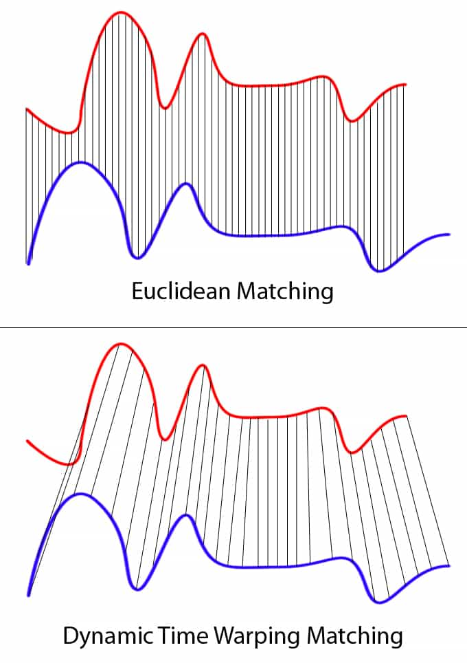
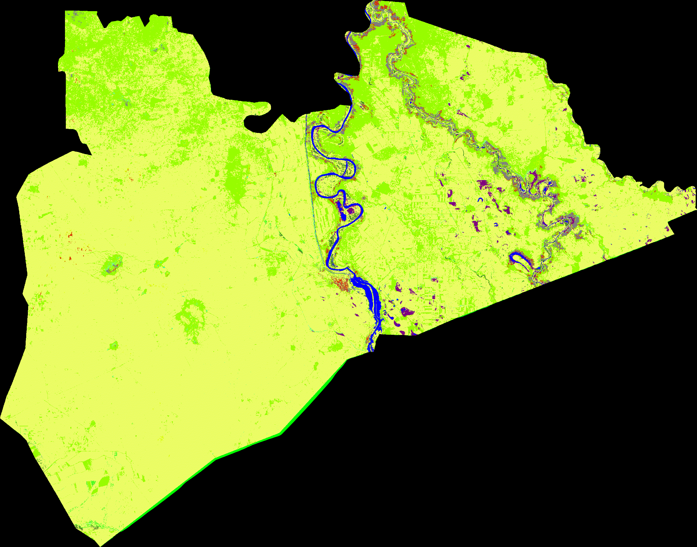

# Multi-Dimensional Dynamic Time Warping Implementation in Google Earth Engine



## Introduction
A multi-dimensional Dynamic Time Warping (DTW) implementation to classify remote sensing image time series dwelling in Google Earth Engine.

Only the JS API has been developed. The Python API implementation will be coming shortly.

## Features
Dynamic Time Warping is an alternative to the somewhat rigid Euclidean Distance for comparing time series alignment.

The recent literature on applying DTW to satellite images time series (SITS) has been integrated in the implementation, namely, the following:

The time-weighted DTW (TWDTW) approach taken from: [Maus, V., Câmara, G., Cartaxo, R., Sanchez, A., Ramos, F. M., & De Queiroz, G. R. (2016).
                                          A time-weighted dynamic time warping method for land-use and land-cover mapping.
                                          IEEE Journal of Selected Topics in Applied Earth Observations and Remote Sensing, 9(8), 3729-3739.](http://www.esensing.org/docs/Maus_TWDTW_JSTARS2016.pdf)

The time-constrained DTW (TCDTW) approach taken from: [Csillik, O., Belgiu, M., Asner, G. P., & Kelly, M. (2019).
                                          Object-based time-constrained dynamic time warping classification of crops using Sentinel-2.
                                          Remote sensing, 11(10), 1257.](https://www.mdpi.com/2072-4292/11/10/1257)

The vector distance (VDTW) approach taken from: [Teke, Mustafa, and Yasemin Y. Çetin.
                                          "Multi-year vector dynamic time warping-based crop mapping."
                                          Journal of Applied Remote Sensing 15.1 (2021): 016517.](https://www.spiedigitallibrary.org/journals/journal-of-applied-remote-sensing/volume-15/issue-1/016517/Multi-year-vector-dynamic-time-warping-based-crop-mapping/10.1117/1.JRS.15.016517.short?SSO=1)

## Usage
The details about parameter setting and their associated methods is described in the main script `dtw.js`.

To use the code, either copy-paste it to your code editor environment, or simply refer to the publicly-available script with the following line:
```js
var DTW = require('users/soilwatch/functions:dtw.js');
```

## Examples

1. **Multi-year land cover mapping using TWDTW to identify abandoned cropland suitable for rangeland restoration**

The script implementing this use case located under the `examples` folder, and can be accessed via this [link](https://code.earthengine.google.com/25f2091a738c3f1f063b4401d84969c4).

The story behind this use case is further described in the following [medium blog post](https://medium.com/@ouelletteweo/dynamic-time-warping-for-satellite-image-time-series-classification-872d9e54b8d).



2. **TBC**

## Dependencies
The JavaScript code for DTW (`dtw.js`) runs in the GEE code editor with out installing additional packages.

The example provided (`examples/twdtw_sudan.js`) relies on the following external dependencies:
- [SoilWatch's soil erosion watch app](https://github.com/SoilWatch/soil-erosion-watch)
- [Mulissa et al.'s Sentinel-1 SAR Backscatter ARD preparation in GEE](https://github.com/adugnag/gee_s1_ard)
- [GEE Community's EE Palettes](https://github.com/gee-community/ee-palettes)

## Credits

- [SoilWatch](https://soilwatch.eu/) and team with boots on the ground for providing valuable contextual information and photos.
- My consultancy work at FAO for TCP/AFG/3706 and [Lorenzo de Simone](https://www.linkedin.com/in/lorenzo-de-simone/) 
  have contributed a great deal in shaping this implementation of DTW in GEE, where it is applied in the context of crop type mapping.
